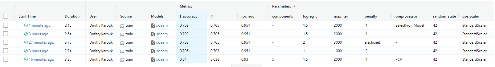
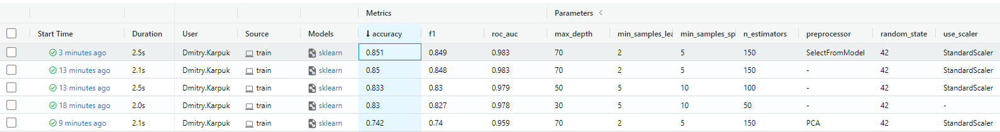

# Report
## Screenshots with description.
1. Results of using LogisticRegression with different hyperparameters and feature enginireeng methods. 

2. Results of using RandomForestClassifier with different hyperparameters and feature enginireeng methods. 

3. Result of using Nested CV with LogisticRegression on 10% of data

4. Result of using Nested CV with LogisticRegression on 10% of data

5. Using nox to project. 

6. Result of tests, task 11.1. 

7. Result of tests, task 11.2. 

